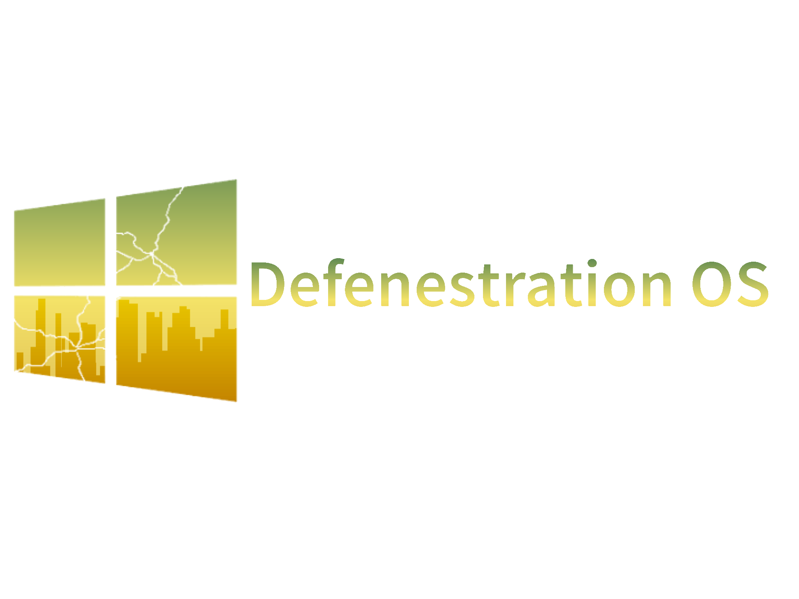
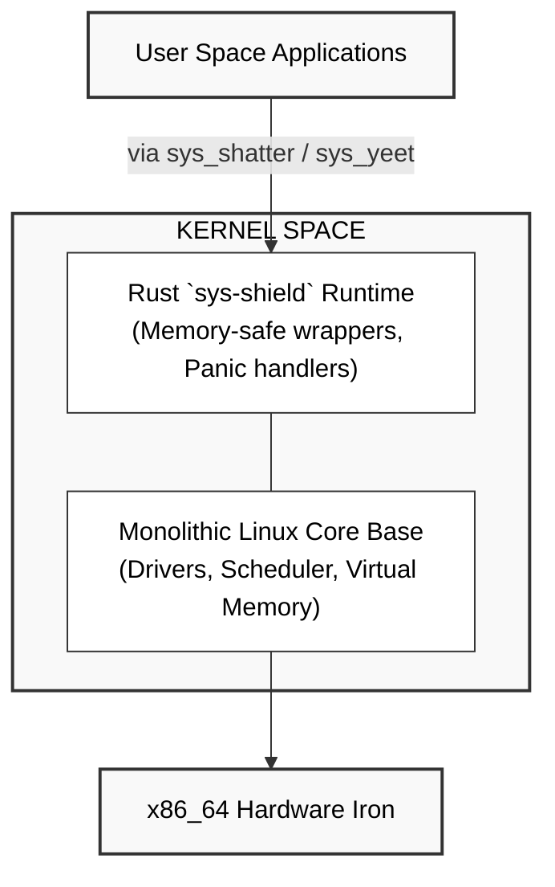

<div align="center">
  
  
  <h1>🪟 💨 Defenestration OS</h1>
  
  <p><b>The ultimate telemetry-free, potato-optimized operating system layout.</b></p>

  
  
  
</div>

---

## 👁️ The Core Philosophy

Modern operating systems have forgotten what a desktop is supposed to be. Defenestration OS treats your hardware with respect:

* **Zero Telemetry:** Completely severed from corporate background tracking, diagnostic logging, and targeted advertisement endpoints.
* **Potato PC Friendly:** Idle memory usage clocks in under **500MB RAM**, giving older hardware and modest laptops a blazingly fast second lease on life.
* **Familiar UX:** A clean, classic bottom-taskbar layout featuring an intuitive application menu—no dynamic tiles, no forced web-search injection, no clutter.
* **Rust-Powered Guardrails:** Core system initialization, performance profiling, and network security layers are handled by a native, ultra-lean Rust engine (`sys-shield`).

---

## 🛠️ System Architecture

Defenestration OS doesn't reinvent the wheel; it strips away the bloat and hardens the chassis.

| Component | Technology | Purpose |
| :--- | :--- | :--- |
| **Upstream Base** | Arch Linux (x86_64) | Providing a minimal, rolling-release binary foundation. |
| **Build Engine** | `archiso` + GitHub Actions | Assembling and mastering bootable system images directly in the cloud. |
| **Core Optimizer** | Rust (`sys-shield`) | Native binary managing low-spec memory tweaks and network hardening. |
| **Interface Layer** | XFCE4 Desktop | Achieving a traditional taskbar layout without heavy resource overhead. |

---

## 🚀 How It Works (Cloud-Native DevOps)

### System Blueprint Overview

The entire repository operates as a **System Blueprint**. 

#### Etymology of the Term
* **Blue**: Originates from Old French *bleu*, stemming from the Old High German word *blāo*.
* **Print**: Derived from the Old French word *preinte*, based on the Latin verb *premere* (meaning "to press").

#### Core Technologies
* **Rust**: The primary programming language, chosen for high performance and safety.
* **Shell Scripting**: Used for login functionalities and other essential system tasks.

> 💡 **Fun Fact**: Although it might seem like there’s no real purpose for reading this, every piece of information contributes to a greater understanding!

# 📑 Defenestration OS — Documentation Manual
## 1. Project Overview & Quick Start
### Introduction
**Defenestration OS** is a high-performance, monolithic operating system built for modern 64-bit hardware. By combining a highly optimized Linux kernel core with our native Rust `sys-shield` runtime layer, Defenestration OS eliminates user-space and kernel-space boundary vulnerabilities—literally "throwing Windows out the window."
* **Target Architecture:** `x86_64` (Standard 64-bit Intel/AMD processors)
* **Kernel Type:** Monolithic (Linux Core + Rust `sys-shield` runtime)
* **Design Philosophy:** Hardware-level speed with compile-time memory guarantees at the subsystem layer.
# Install toolchain dependencies
```bash
sudo apt install build-essential libelf-dev binutils-x86-64-linux-gnu cargo rustc
```
# Clone the codebase
```bash
git clone https://github.com/n1nerlang/Defenestration.git
cd Defenestration
```
# Build kernel image and compile the Rust sys-shield modules
```make defenestrate-all```
### Building from Source
Defenestration OS requires a dual-toolchain environment setup (`gcc`/`clang` for core structures, and `rustc`/`cargo` for the `sys-shield` isolation layers).
### Launching the System
Test the compiled raw disk image in an isolated x86_64 emulator environment:
# Launch via QEMU with hardware acceleration enabled
``qemu-system-x86_64 -enable-kvm -m 2G -drive format=raw,file=build/defenestration.img -serial stdio``
## 2. System Architecture & Kernel Design

### The `sys-shield` Isolation Framework
The monolithic core is wrapped by a proprietary Rust abstraction framework called **sys-shield**. 
* **Zero-Cost Abstractions:** It intercepts kernel module execution to guarantee spatial memory safety without introducing execution overhead.
* **Panic Recovery:** If a monolithic driver faults, `sys-shield` catches the unhandled exception before a full Kernel Panic occurs, enforcing state isolation.
### Memory Management & Paging
Defenestration OS leverages the standard 4-level paging hierarchy native to x86_64 processors.
* **Kernel Mapping:** The kernel is mapped into the higher half of the virtual address space (`0xFFFFFFFF80000000`).
* **NX (No-Execute) Bit Enforcement:** The `sys-shield` layer strictly audits page tables, ensuring data pages (like the heap) cannot execute malicious machine instructions.
***
## 3. Defenestration System Calls (ABI specification)
Applications communicate with the monolithic core using the standard x86_64 native `syscall` instruction. Registers are loaded as follows: `RAX` (Syscall ID), `RDI` (Arg 1), `RSI` (Arg 2), `RDX` (Arg 3).

| RAX ID | System Interface Name | Argument Signature | Rust `sys-shield` Action |
| :--- | :--- | :--- | :--- |
| `0x0A` | `sys_shatter` | `rdi: int exit_code` | Instantly drops process allocation pools. |
| `0x0B` | `sys_yeet` | `rdi: int fd, rsi: void *buf, rdx: size_t count` | Flushes safe memory buffers to descriptor endpoints. |
| `0x0C` | `sys_catch` | `rdi: int fd, rsi: void *buf, rdx: size_t count` | Populates initialized buffers via hardware inputs. |
***
## 4. Hardware Initialization & Drivers
Because the system utilizes an optimized monolithic Linux base, it inherits broad out-of-the-box x86_64 driver support, which is managed via `sys-shield` initializers.
* **Interrupt Infrastructure:** Configures the Advanced Programmable Interrupt Controller (APIC) for high-performance multicore thread distribution.
* **Graphics Mode:** Drops legacy VGA text mode early in the boot cycle to establish an expansive, linear VESA/GOP hardware frame-buffer configuration.
***
## 5. Storage & File System (GravityFS)
The physical storage layer is managed by **GravityFS**, a high-speed, crash-resilient file system designed specifically to scale cleanly on modern NVMe and SATA SSD storage arrays.
* **Metadata Protection:** All directory entries are verified using Rust validation logic before being updated on disk.
* **The Drop Zone:** Temporary variables and build caches are routed to an in-memory virtual directory (`/drop/`), maximizing disk lifespans.
